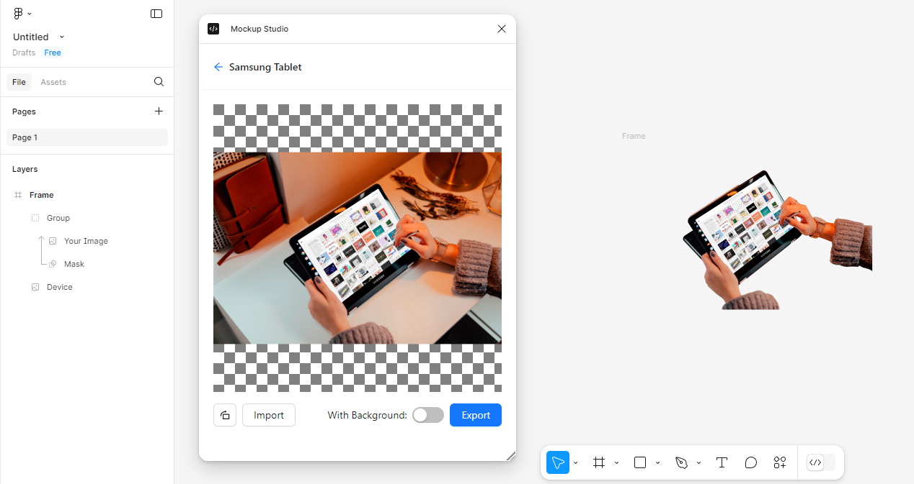

# Figma Mockup Plugin

## Overview

This is a prototype of a figma plugin for creating mockups. The user can select any mockup in the gallery, then the selected node can be imported and the perspective transformation will be applied to it. After that, the mockup layers can be exported back to figma.

The plugin uses [Antd](https://ant.design/) components library for ui, [MobX](https://mobx.js.org/) for state management and logic, [Pixi.js](https://pixijs.com/) as a graphics engine.

## Installing and running

The plugin is built on top of [this template](https://github.com/CoconutGoodie/figma-plugin-react-vite), follow the instructions in the corresponding repository.
Server code is located in "express-server" folder, don't forget to install dependencies and run it.

## File Structure

#### General

    .
    ├── express-server         # Backend
        ├── assets             # Mockup files served to user
        ├── data               # SQLite folder
        └── src                # Server source code
    ├── src                    # Frontend code
        ├── common             # Sources that are intended to be used both by plugin and ui logical sides
        ├── plugin             # Sources of the plugin logical side
        └── ui                 # Sources of the ui logical side
    ├── tests                  # E2E playwright tests
    ├── LICENSE
    └── README.md

##### UI

    .
    ├── ...
    ├── ui                     # Sources of the ui logical side
    │   ├── components         # React components
    │   ├── pages              # Pages for each route
    │   ├── providers          # React context providers
    │   ├── stores             # MobX data stores
    │   └── styles             # CSS
    └── ...

## Layers

The image is composed of a background, a device, and a user image in png/jpg format. A mask is applied to the user image, it is in svg format with one `<path>` element node. `<path>` may contain several subpaths, in which case the first subpath will be the main one, and the rest will be cut out from it. The transformation vector of the user image is also in svg format, with one `<polygon>` node, in which the first coordinate corresponds to the upper left corner of the device.